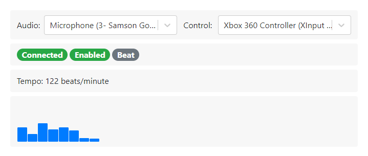

A bunch of scripts to control my home lights.

* Speaks DMX over IP using sACN.
* Web UI for basic control
* Controllable by PS4/XBox controller.
* Sound reactive.
* Python 3.
* Windows + Linux compatible.

---

1. `pipenv install`
2. `cd homestage`
3. `npm install`
4. `npm run gulp`
5. `cd ..`
6. `pipenv shell`
7. `python homestage-server.py --config config.json`
8. Open browser to http://localhost:8923 and configure
