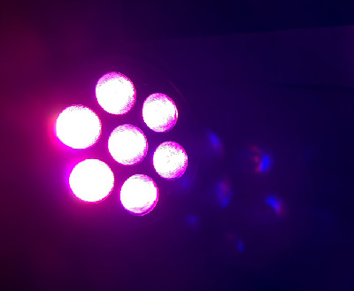
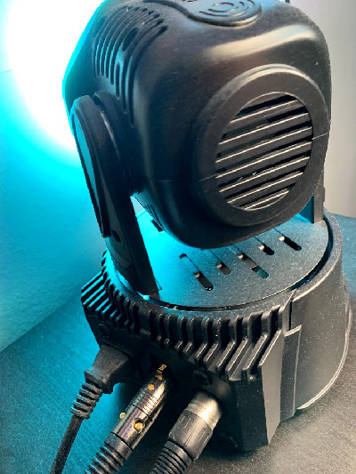
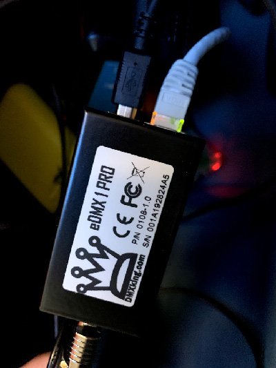
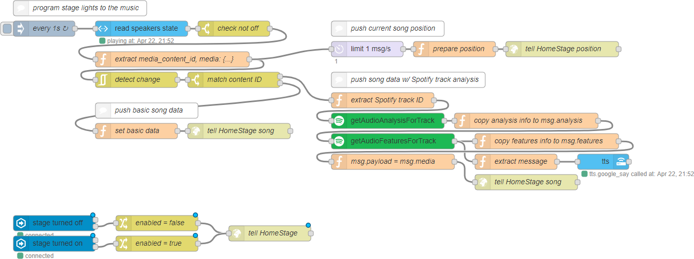

# HomeStage

Let's say you a little home automation going on, like enjoying music and happen to own some stage lights, and you want to make it a 🔥 music room.

WELCOME TO HOMESTAGE.

This project is a work-in-progress and you're on your own right now.

## What it do?

The app listens to what's playing, integrates it with information from Spotify, and tries to control your stage lights using DMX over sACN using automatic patterns based on your current music.

## How much actually works?

It works but there are not enough patterns yet.

A little RAVEY too. Needs to work on better rock/punk music too. 🤘

***Think of the fun!***



## Requirements

* Some good ol' stage lights
* sACN receiver to output DMX
* A computer/server somewhere WITH A MICROPHONE in a strategic location
* node-red if you want to use what's playing from Chromecast/etc. and feed it into HomeStage




## Low key this gonna get nerdy

HomeStage is controlled by a HTTP API.

* POST /api/media/ - updates the media and provides energy, valance, etc. values from Spotify
* POST /api/media/position/ - keeps HomeStage in sync with where in the song we are
* POST /api/enabled/ - lets you turn on/off HomeStage so it doesn't use CPU when you are not raving

Once HomeStage is started, it automatically analyzes playing audio and outputs DMX signals. To make it better, it accepts information about the currently playing media (using data from Spotify at the moment) to determine when best to rotate and how best to choose patterns.

HomeStage doesn't know how to figure out eactly what song you're playing right now. It relies on that HTTP request to be made. That's where node-red comes in: it listens for song changes in your Chromecast/etc. system, requests more information from Spotify, and then pushes it to HomeStage.

## Setup

You need Python 3.6+.

This theoretically can work on Windows but you have to get some libraries compiled and it's no fun.

1. Install dependencies using pipenv.
2. You're probably going to have to program your DMX devices. Sorry. See homestage/devices.py
3. Make a config.py file like this:
    ```python
    import soundcard as sc
    from homestage.devices import MovingHeadLight, LEDWash
    
    head = MovingHeadLight()
    wash = LEDWash()
    
    DEVICES = [head, wash, wash]
    
    RECORDING_DEVICE = None
    mics = sc.all_microphones()
    for mic in mics:
        if 'Name of mic' in str(mic):
            RECORDING_DEVICE = mic
            break
    
    if RECORDING_DEVICE is None:
        raise Exception("couldn't find microphone")
    
    SACN_MULTICAST = False
    SACN_HOST = "192.168.0.1"
    
    WEB_SERVER_HOST = '0.0.0.0'
    WEB_SERVER_PORT = 8923
    ```
4. Run `./homestage-server.py`
5. Setup the node-red flow

### node-red flow



[Get the flow](readme/nodered_flow.json)